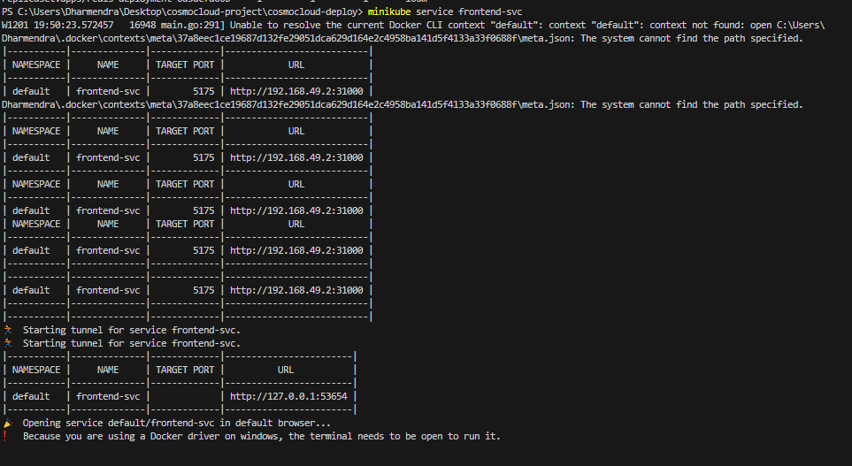

# CosmoCloud Deployment Helm Chart

This is a Helm chart to deploy the **CosmoCloud Application Stack**, consisting of:
1. **Backend** Service
2. **Frontend** Service
3. **Redis Database**

The chart ensures that all services are correctly deployed with appropriate configurations for scalability and maintainability.

---

## Prerequisites

Before deploying the chart, make sure the following are installed and configured:
1. A running **Kubernetes cluster** (e.g., Minikube or any managed cluster like EKS, GKE, etc.).
2. **Helm** version 3.x or above.
3. **kubectl** installed and pointing to the cluster.

---

## Deployment Instructions

### Step 1: Clone the Repository
Clone this repository to your local machine:
```bash
git clone https://github.com/ProgrammingPirates/cosmocloud-deploy.git
cd cosmocloud-deploy
```

### Step 2: Verify Setup
Ensure `helm` and `kubectl` are installed and working:
```bash
helm version
kubectl version
```

### Step 3: Deploy the Chart
Run the following command to deploy the application:
```bash
helm install testapp cosmocloud-deploy --atomic --timeout 30s
```


### Step 4: Verify Deployment
Check that all pods and services are running:
```bash
kubectl get all
```

### Step 5: Access the Frontend
For Minikube users, you can open the frontend directly in your browser:
```bash
minikube service frontend-svc
```


For other clusters, get the **NodePort** and open it in your browser:
```bash
kubectl get service frontend-svc
```

---

## Configuration Details

### Components Overview
| Component   | Service Type | Port(s)        | Environment Variables                     | Replicas |
|-------------|--------------|----------------|-------------------------------------------|----------|
| Backend     | ClusterIP    | 8000           | `REDIS_URI=redis://redis-svc:6379`        | 1        |
| Frontend    | NodePort      | 5175, 31000    | `BACKEND_URL=http://backend-svc:8000`     | 1        |
| Redis       | ClusterIP    | 6379           | None                                      | 1        |

### Key Helm Chart Files
- **Chart.yaml**: Contains metadata about the chart.
- **values.yaml**: Stores default values for configuration.
- **templates/**: Includes all the Kubernetes resource templates for deployment.

### Environment Variables
- **Backend**: The environment variable `REDIS_URI` is set to `redis://redis-svc:6379`.
- **Frontend**: The environment variable `BACKEND_URL` is set to `http://backend-svc:8000`.

---

## Helm Chart File Details

### Chart.yaml
Defines the Helm chart's metadata:
```yaml
apiVersion: v2
name: cosmocloud-deploy
description: A Helm chart for CosmoCloud application stack
type: application
version: 0.1.0
appVersion: "1.0.0"
```

### values.yaml
Stores default configuration values:
```yaml
replicaCount: 1

backend:
  image: shreybatra/sample-backend
  service:
    type: ClusterIP
    port: 8000
  env:
    REDIS_URI: redis://redis-svc:6379

frontend:
  image: shreybatra/sample-frontend
  service:
    type: NodePort
    port: 5175
    nodePort: 31000
  env:
    BACKEND_URL: http://backend-svc:8000

redis:
  image: redis
  service:
    type: ClusterIP
    port: 6379
```

---

## Validation Steps

1. **Backend**:
   - Deployment: Ensure a pod is running for the backend service.
   - Service Type: `ClusterIP`.
   - Port: `8000`.

2. **Frontend**:
   - Deployment: Ensure a pod is running for the frontend service.
   - Service Type: `NodePort`.
   - Ports: Internal `5175`, External `31000`.

3. **Redis**:
   - Deployment: Ensure a pod is running for Redis.
   - Service Type: `ClusterIP`.
   - Port: `6379`.

---

## Notes
- The application is deployed to the `default` namespace.
- Use the following command to test deployment:
  ```bash
  helm install testapp cosmocloud-deploy --atomic --timeout 30s
  ```
- Ensure all resources (pods, services) are in a **Running** state before accessing the application.
